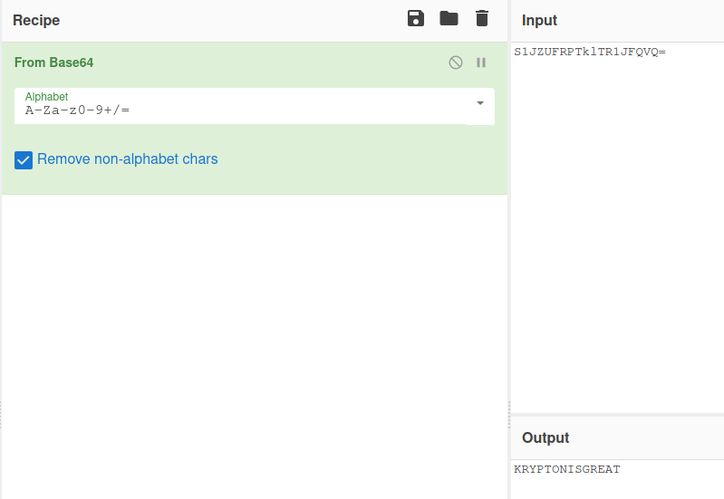

# Krypton1 - Base64  
  
[Krypton Level 0 &rarr; 1](https://overthewire.org/wargames/krypton/krypton0.html)  
  
For the first level of Krypton, we are given the following ciphertext  
> S1JZUFRPTklTR1JFQVQ=  
  
This is a [Base64](https://en.wikipedia.org/wiki/Base64) encoded string representing the password.  
  
One of the easiest ways to decode this is to use [CyberChef](https://gchq.github.io/CyberChef). CyberChef is a collection of tools that can be used in cryptography. We simply copy our input into the input window, drag in the function we want from the left, and the output will appear on the right.  
  
  
  
Alternatively we can use a simple Python program (other languages are available) to do the same thing.  
```Python  
import base64  
  
cipherText = input("Enter encoded String: ").encode("UTF8")  
plainText = base64.decodebytes(cipherText).decode("UTF8")  
print("Decoded string is \\"{}\\"".format(plainText))  
```  
  
From this we can see the password for the next level is :  
> KRYPTONISGREAT  
