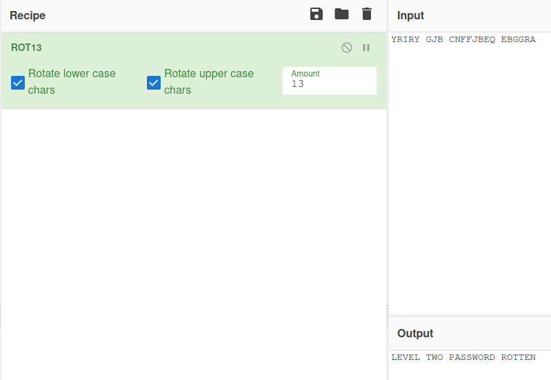

# Krypton2 - ROT-13  
  
[Krypton Level 1 &rarr; 2](https://overthewire.org/wargames/krypton/krypton1.html)  
  
For this level of Krypton, we are given the following ciphertext  
> `YRIRY GJB CNFFJBEQ EBGGRA`  
  
We are told the password has been encypted with a simple rotation cipher. This is a type of [Caesar Cipher](https://en.wikipedia.org/wiki/Caesar_cipher) so there are only 25 possible solutions. One of the most common keys to use is 13, also known as [ROT-13](https://en.wikipedia.org/wiki/ROT13). This is a good one to try if you don't feel like brute forcing all 25 possibilities. Luckily for us, [CyberChef](https://gchq.github.io/CyberChef) has this built in.  
  
  
  
Alternatively, we can use a simple Python script:  
```Python  
def rotate(text, key):  
    rotated = ""  
    for char in text:  
        if char == " ":  
            rotated += " "  
            continue  
        intVal = ord(char) - ord("A")  
        shiftedVal = (intVal + key) % 26  
        rotated += chr(ord("A") + shiftedVal)  
    return rotated  
  
def ROT13(text):   
    return rotate(text, 13)  
  
cipherText = input("Enter encrypted string: ")  
plainText = ROT13(cipherText)  
print("Decrypted string is: {}".format(plainText))  
```  
  
Using ROT-13 on the input we get the output  
> `LEVEL TWO PASSWORD ROTTEN`  
  
which tells us that the password we need is `ROTTEN`  
  
