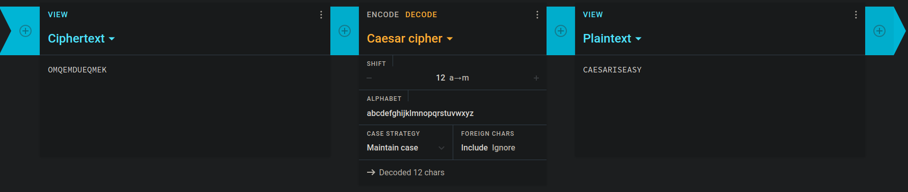

# Krypton3 - Caesar Cipher  
  
[Krypton Level 2 &rarr; 3](https://overthewire.org/wargames/krypton/krypton2.html)  
  
For this level of Krypton, we are given the following ciphertext  
> `OMQEMDUEQMEK`  
  
Similar to last level, we are told we need to use a [Ceasar Cipher](https://en.wikipedia.org/wiki/Caesar_cipher). For this I will use [Cryptii](https://cryptii.com/pipes/caesar-cipher) to increment over all possibilities until one jumps out, as we know that the password is in English.   
  
  
  
Alternative Python script to do the same thing:  
```Python  
def rotate(text, key, mode="ENCRYPT"):  
    if mode == "DECRYPT":  
        key = 26 - key  
    rotated = ""  
    for char in text:  
        if char == " ":  
            rotated += " "  
            continue  
        intVal = ord(char) - ord("A")  
        shiftedVal = (intVal + key) % 26  
        rotated += chr(ord("A") + shiftedVal)  
    return rotated  
  
  
cipherText = input("Enter encrypted string: ")  
for key in range(26):  
    print("key: {0} - text: {1}".format(key, rotate(cipherText, key, mode="DECRYPT")))  
```  
  
Reaching a shift of 12 reveals the password as `CAESARISEASY`  
  
